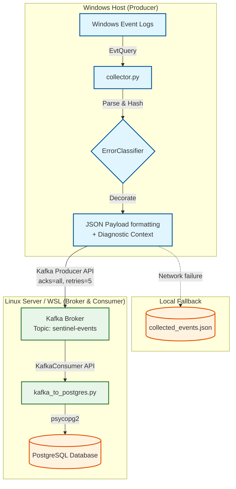

# SentinelCore

A production-grade Windows telemetry agent focused on **System Stability, Critical Fault Detection, and ML Training Data Generation**. Uses the modern Windows Eventing API (EvtQuery) to collect high-value system events, categorizes them for diagnostic ML pipelines, and streams them through a Kafka → PostgreSQL data pipeline.

## Architecture & Data Flow



## Features (v4.0.0)

### Log Collection & Classification

- **Targeted Monitoring**: System, Kernel-Power, and DriverFrameworks logs.
- **Auto-Classification Engine**: Classifies events into ML-ready labels (`SYSTEM_FAULT`, `DRIVER_ISSUE`, `SERVICE_ERROR`, `RESOURCE_WARNING`, `SECURITY_EVENT`, etc.).
- **Diagnostic Context**: Attaches point-in-time system resource snapshots (CPU >90%, Mem >90%, Disk <10%) to the exact moment an error occurred.

### Production Hardening

- **Guaranteed Delivery**: Producer confirms every message explicitly via `future.get(timeout=10)`. No silent drops.
- **Resilience**: Producer gracefully handles Kafka outages with exponential backoff reconnections, while Consumer handles DB outages identically.
- **Transactional Consistency**: Consumer implements batch-level rollbacks and delays Kafka offset commits until DB insert is confirmed.
- **Storage Guard**: Automatically pauses collection if system disk drops below 1GB free space.
- **Graceful Elevation**: Detects Administrator privileges via channel probing and falls back gracefully when limited.

### Data Pipeline (Kafka + PostgreSQL)

- **Kafka Publishing**: Events streamed to Kafka topic `sentinel-events` via `kafka-python-ng`.
- **PostgreSQL Consumer**: Standalone `kafka_to_postgres.py` script reads from Kafka and writes to PostgreSQL with idempotent dedup (`ON CONFLICT DO NOTHING`).
- **Three Delivery Modes**: Local file (testing), Kafka pipeline, or HTTPS — switchable via environment variables.

### Data Integrity

- **Hardware-Tied Hashing**: SHA256 hashes for deduplication using `(raw_xml + machine_guid + record_id)`.
- **Atomic Checkpoints**: Checkpoints only advance if transmission to the server succeeds.

## Project Structure

```text
SentinelCore/
├── src/                          # Core agent and data pipeline
│   ├── collector.py              # Main log collection and Kafka publisher (Run on Windows)
│   ├── kafka_to_postgres.py      # Kafka → PostgreSQL consumer (Run in WSL/Linux)
│   ├── analyze_logs.py           # Helper functions for log analysis
│   └── enhanced_analyzer.py      # Advanced ML correlation framework
├── tests/                        # End-to-end and live testing suite
│   ├── test_e2e.py               # E2E unit tests
│   ├── test_live_errors.py       # Live testing against real Windows Event Log
│   └── validate_collector.py     # Pipeline dependency validator
├── deploy/                       # Fully automated deployment tooling
│   └── deploy_startup.ps1        # Registers agent as a SYSTEM service
├── docs/                         # Documentation and Guides
│   ├── LOCAL_TESTING_GUIDE.md    # Local testing and Kafka pipeline usage
│   └── WSL_KAFKA_POSTGRES_SETUP.md  # WSL infrastructure setup
├── config.json                   # Pipeline configuration and Kafka tuning parameters
├── requirements.txt              # Standard Python dependencies
└── README.md
```

## Complete Project Setup Guide

**Requirements:** Windows 10/11, WSL (Ubuntu), Python 3.9+

### Phase 1: WSL Infrastructure (Kafka & PostgreSQL)

Before the Windows agent can run, the receiving pipeline must be online.

1. Install Kafka and PostgreSQL in WSL. Detailed steps are in [docs/WSL_KAFKA_POSTGRES_SETUP.md](docs/WSL_KAFKA_POSTGRES_SETUP.md).
2. Configure `config.json` in the root directory on the Windows side. Ensure `bootstrap_servers` matches your WSL IP address:
   ```json
   {
     "kafka": {
       "bootstrap_servers": "172.30.178.75:9092",
       "topic": "sentinel-events",
       "client_id": "windows-test-agent",
       "acks": "all",
       "retries": 5,
       "retry_backoff_ms": 3000,
       "linger_ms": 50,
       "request_timeout_ms": 15000
     },
     "agent": {
       "system_id_mode": "AUTO",
       "batch_size": 20,
       "retry_attempts": 3,
       "retry_backoff_seconds": 3
     }
   }
   ```

### Phase 2: Start the Consumer in WSL

The consumer script (`src/kafka_to_postgres.py`) connects to Kafka, subscribes to the topic, and writes events to the PostgreSQL database.

1. Open a WSL Ubuntu terminal.
2. Install consumer dependencies:
   ```bash
   pip install kafka-python-ng psycopg2-binary
   ```
3. Run the consumer script:
   ```bash
   python3 src/kafka_to_postgres.py
   ```
4. Leave this running in the terminal. It uses exponential backoff to handle any temporary network interruptions automatically.

### Phase 3: Start the Collector Agent on Windows

The collector script (`src/collector.py`) monitors Windows Event Logs, structures them, and pushes them to Kafka.

1. Open **PowerShell as Administrator**.
2. Install producer dependencies:
   ```powershell
   pip install -r requirements.txt
   ```
3. Run the collector manually to verify data flow:
   ```powershell
   $env:SENTINEL_KAFKA_MODE = "true"
   python src\collector.py
   ```
4. Watch the WSL terminal to confirm the consumer successfully inserts the events into PostgreSQL.

### Phase 4: Install as an Automated Background Service

Once you verify the pipeline works perfectly, you can configure SentinelCore to run silently in the background every time Windows boots.

1. Open **PowerShell as Administrator**.
2. Run the deployment script:
   ```powershell
   cd C:\path\to\SentinelCore
   .\deploy\deploy_startup.ps1
   ```
   This script does the following:

- Installs dependencies
- Creates an isolated Python virtual environment (`.venv`)
- Creates a Scheduled Task named `SentinelCore Agent` that elevates as the `SYSTEM` user
- Runs invisibly on OS startup

If you ever need to stop the background agent, simply delete the scheduled task or stop it from the Windows Task Scheduler GUI.

## ML Target Schema

The structured JSON payload is designed for direct ingestion into Machine Learning pipelines for predictive maintenance models:

```json
{
  "system_id": "machine-guid",
  "events": [
    {
      "fault_type": "DRIVER_ISSUE",
      "severity": "WARNING",
      "provider_name": "Microsoft-Windows-Kernel-PnP",
      "event_id": 219,
      "cpu_usage_percent": 45.2,
      "memory_usage_percent": 88.1,
      "disk_free_percent": 15.0,
      "message": "Microsoft-Windows-Kernel-PnP Event 219 (WARNING) on channel System",
      "created_at": "2026-02-27T01:30:00Z",
      "diagnostic_context": {
        "resource_alert": ["HIGH MEMORY"]
      },
      "raw_xml": "<Event>...</Event>"
    }
  ]
}
```

## License

Production-grade software. Ensure compliance with your organization's telemetry policies before deployment.
