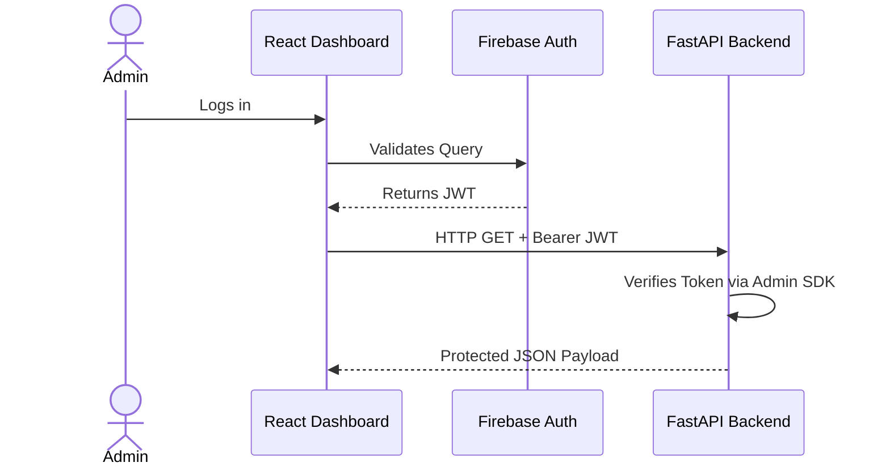

# API Reference

SentinelCore provides an extensive ASGI backend to power dashboard observability, built on FastAPI.

## Global Headers
Nearly all REST routines require the dynamic Google Identity Token generated through Firebase:
`Authorization: Bearer <GOOGLE_ID_TOKEN>`

### Authentication Flow

## Endpoints

### 1. `GET /events`
Fetches paginated telemetry sequences dynamically.
- **Parameters:**
  - `system_id` (string)
  - `fault_type` (string)
  - `severity` (string)
  - `search` (string)
- **Response:** JSON Array containing complex diagnostic metadata and string fields parsed natively from raw Kafka ingestion XML streams.

### 2. `GET /metrics`
Aggregates temporal usage statistics over global event nodes.
- **Parameters:**
  - `system_id` (string)
  - `start_time` (iso8601 string)
  - `end_time` (iso8601 string)
- **Response:** JSON Array `[{time, avg_cpu, avg_memory, event_count}]` directly translatable into Recharts coordinates.

### 3. `GET /systems`
Fetches a list of total online/offline endpoint signatures.
- **Response:** JSON Array identifying the tracked WMI nodes with latest heartbeat variables.

### 4. `POST /systems/command`
Simulates a Remote Procedure Execution (RCE) natively pushed down toward an administrative terminal modal on the frontend UI.
- **Payload:** `{system_id: str, command: str}`
- **Response:** JSON Array returning standardized mock responses for system restarts.

### 5. `/alerts` Base
Configures the rules engine governing automated anomaly detection alerts.
- **`GET /alerts/recent`:** Fetches the top 10 unacknowledged alerts dropping out of the notification topbar.
- **`GET /alerts/rules`:** Returns registered criteria thresholds against WMI nodes.
- **`POST /alerts/rules`:** Registers new alert specifications directly to Postgres schemas.

### 6. `/ml` Base
Exposes the predictive analytics framework passively evaluating `feature_snapshots`.
- **`GET /ml/predictions`:** Exhaustive JSON lists of historical system profiles.
- **`GET /ml/anomaly`:** Time-series formatted anomaly grades.
- **`GET /ml/failure-risk`:** Likelihood percentages tied to extrapolated fault_types.
- **`GET /ml/clustering`:** Isolation Forest cluster grouping insights for SOC dashboard tracking.

### 7. Core Internals
- **`GET /pipeline-health`:** High-level ingestion and processing speeds across Kafka limits.
- **`GET /report/generate`:** Synthesizes `dashboard_metrics` + `system_failures` as a downloadable Blob.
- **`POST /publish`:** Single-entrypoint legacy hook verifying `COLLECTOR_SECRET` PSKs against arriving Edge nodes.
