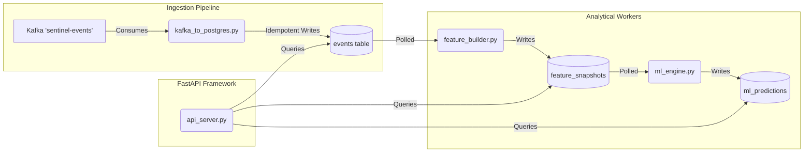

# Backend Services Overview

SentinelCore’s backend is logically separated into four persistent Python demons. Each file operates independently holding isolated responsibilities toward the data lifecycle.

## Pipeline Architecture

## 1. `kafka_to_postgres.py` (The Consumer)
This worker script is responsible for draining Kafka `sentinel-events` topics into permanent relational storage.
- **Key Features:**
  - Implements an exponential backoff circuit-breaker allowing zero-loss DB recoveries in cases of Postgres downtime.
  - Formats payloads identically and leverages heavily indexed `event_hash` upserts preventing data duplication.
  - Dynamically triggers native garbage collection limits across the overarching `events` table resolving long-term unpartitioned data bloat.

## 2. `api_server.py` (The API)
This is an ASGI web framework built on FastApi (`uvicorn`) servicing frontend telemetry requirements.
- **Key Features:**
  - Employs strict `@require_auth` interceptors which validate Google Application Credentials generated by the React UI.
  - Exposes REST queries like real-time anomaly filtering and SQL-bound dashboard metrics.
  - Writes permanent mutations (alert escalations) directly back into a secure operational `audit_logs` table.

## 3. `feature_builder.py` (The Aggregator)
Background worker compiling high-frequency `events` log insertions into system-wide profile rows over polling thresholds.
- **Key Features:**
  - Loops over database `DISTINCT ON (system_id)` views gathering generic statistics natively.
  - Writes heavily compressed `feature_snapshots` mapping complex log queries into a single database row, permitting instantaneous UI responsiveness over thousands of systems.

## 4. `ml_engine.py` (The Predictive Analytics Module)
Background worker analyzing `feature_snapshots` data directly and computing likely imminent system vulnerabilities using an Isolation Forest ML pipeline.
- **Key Features:**
  - Maps anomalies to distinct `failure_probability` scoring and calculates feature clustering insights.
  - Implements non-blocking ML execution triggered safely by the `feature_builder` after data ingestion.
  - Outputs directly to `ml_predictions` schemas to be historically grafted within `/ml/*` API views.
  - Consumes domain-specific configuration variables exclusively through `src/shared/ml_constants.py`.
